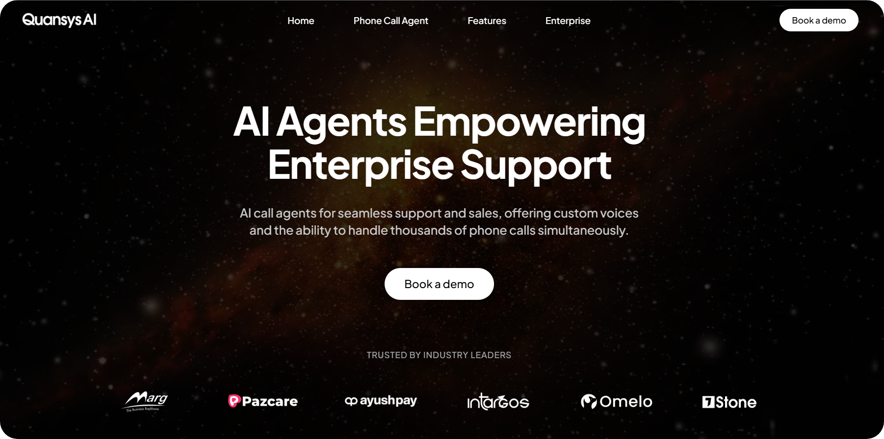

# QuansysAI-Website



## Description
A modern website showcasing QuansysAI's services and solutions, built with cutting-edge technologies for optimal performance and user experience.

## Quick Start Guide

### Prerequisites
* Node.js (v18 or higher)
* npm or yarn
* SSL certificate (for production)

### Step-by-Step Installation

1. **Clone the Repository**
   ```bash
   git clone https://github.com/QuansysAI/website.git
   cd website
   ```

2. **Environment Setup**
   ```bash
   cp .env.example .env
   # Update .env with your configuration
   ```

3. **Install Dependencies**
   ```bash
   npm install
   # or
   yarn install
   ```

4. **Development Mode**
   ```bash
   npm run dev
   # or
   yarn dev
   ```
   The site will be available at `http://localhost:3000`

5. **Production Build**
   ```bash
   npm run build
   npm run start
   # or
   yarn build
   yarn start
   ```

### SSL Configuration

1. **Place SSL Certificates**
   - Put your SSL certificates in the `/ssl` directory:
     - `certificate.crt`
     - `private.key`
     - `ca_bundle.crt` (if required)

2. **Update SSL Configuration**
   ```bash
   # In your .env file
   SSL_ENABLED=true
   SSL_CERT_PATH=/ssl/certificate.crt
   SSL_KEY_PATH=/ssl/private.key
   ```

3. **Start with HTTPS**
   ```bash
   npm run start:ssl
   # or
   yarn start:ssl
   ```

## Key Features
* 🎨 Responsive Design
* ⚡ Modern UI/UX
* 🔄 Interactive Components
* 📱 Mobile-First Approach
* 🔍 SEO Optimized

## Project Structure
```
website/
├── src/
│   ├── components/   # Reusable UI components
│   ├── pages/        # Page components
│   └── styles/       # Global styles
├── public/           # Static assets
├── ssl/             # SSL certificates
└── tests/           # Test files
```

## Available Commands
```bash
npm run dev      # Start development server
npm run build    # Build for production
npm run start    # Start production server
npm run test     # Run tests
npm run lint     # Run linting
npm run start:ssl # Start with SSL
```

## Contributing
1. Fork the repository
2. Create your feature branch (`git checkout -b feature/AmazingFeature`)
3. Commit your changes (`git commit -m 'Add some AmazingFeature'`)
4. Push to the branch (`git push origin feature/AmazingFeature`)
5. Open a Pull Request

## Support
For support, email support@quansys.ai or join our Slack channel.

## License
MIT License - See LICENSE file for details

## Contact
* Website: [quansys.ai](https://quansys.ai)
* Email: contact@quansys.ai
* LinkedIn: [QuansysAI](https://linkedin.com/company/quansysai)
